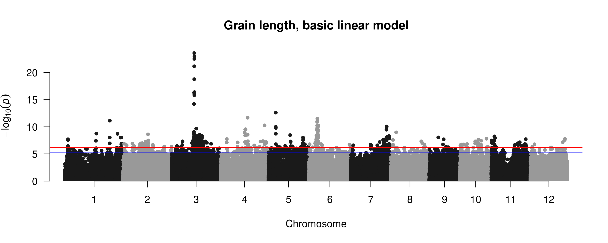

GWAS in Crop Galaxies
========================================================
author: 
date: July 19, 2020
autosize: true
transition: none

GWAS 
========================================================

Assume some background about GWAS.

Overview of the workflow:
 
 - data preparation
 - preliminary analyses
 - run GWAS models
 - evaluate results
 

Getting data into Galaxy
========================================================

- Upload (e.g. your phenotype data)

- Data Libraries (e.g. 3K geno data)

- Other methods (not in this tutorial)

For this tutorial, we will use a subset of 3,000 rice genomes dataset.

We randomly selected 500 samples, then filtered and LD-pruned the dataset.

Resulting dataset is 500 samples $\times$ 629 k SNPs.

Get Genotype data from Data libraries
========================================================

Navigate to **Data Libraries** in the top menu

Select *Test Dataset*. Then select GEMMA

***

Get Genotype data from Data libraries
========================================================

***
Create a new "History" named "myGWAS".

If successful, will look like this:

Note on using your own genotype data
==================================================

 - required genotype format: PLINK binary (bed/bim/fam)
 - You can convert a text PLINK dataset (PED/MAP) into binary one using another tool in Crop Galaxies:  "Convert PED to binary"
 - you can convert many formats into PLINK text dataset using TASSEL software.
 (including most commonly used *HapMap* and **VCF** datasets)

Data preparation & preliminary analyses
===============================
type: section

Data preparation & preliminary analyses
===============================
- LD pruning

- Joining phenotype and genotype data

- PCA (Population structure)

- Kinship matrix

LD pruning
========================================================

Removing SNPs that are correlated ("in high LD") to other SNPs.

Why LD pruning?

|  LD pruned | Filtered    |
| -----------|-------------|
| Less SNPs  | More SNPs   |
| Faster GWAS | Slower GWAS | 
| Lower peaks (miss top SNPs) | **Higher peaks** (more complete) | 
| **More correct QQ plot** | Biased QQ plot | 

LD pruning
========================================================
Select **PLINK tools** then **LD prune**
Select appropriate datasets 

***

Parameters: 

 - window size 25  (it's in kilobases), 
 - window size 1
 - $R^2$ threshold:  $0.6$  

Click "Execute"

  
Principal Component Analysis (PCA)
========================================================

Why need PCA
* One of tools to correct for population structure
* Try Linear model with and without PCA covariates
* Even in mixed linear model , PCA often helps

We can use PCA in GWAS in two wayss
* assess population structure - visualize PCA and PC vs phenotype
* include as covariates in MLM GWAS ( create covariates file from PCA eigenvector file )

Compute PCA using PLINK
========================================================
Find the tool  **Compute Principal Components** within **GEMMA** tools section.

Select the datasets.

Click **Execute** 

***

The history will be updated by 3 files:

We will use the "PCA covariate file".

Optional: Visualize the PCA
=========================================
We will use the **Visualization** menu in the top navbar. This feature requires registration. 

Search for **Scatterplot**, select "nvd3" scatterplot.

Put appropriate axes labels, select data sources

Create a covariates file
========================================================
We could either use PCA covariates file directly, or, if we decide to use smaller number of PCs, cut the first N+1 column.

Let's use the first 3 PCs only. 

The "Cut" tool allows specifying columns as "c1-c4".  
***

Add phenotype to PLINK dataset
========================================================

 > Tool:  Add Pheno to FAM file

Select FAM from genotype dataset and a phenotype dataset

***
This creates 4 outputs (2 for each trait)

Compute Kinship matrix
========================================================
Wrong way 

***
Right: use a .fam file that has phenotype

Run GWAS
========================================================

We will first do MLM based GWAS
    
  > Tool: Mixed Linear Model
   
Expected outputs: 
- log file
- results table containing p-values

***

Look at GWAS results
========================================================

========================================================
height: 80%

Plot Results
========================================================

Manhattan plot
* see peaks, watch fors anomalities 

QQ plot - check P-value inflation 
 * seen in the lowest part of the plots

logP threshold to call it a peak
============================================
Methods of multiple test corrections.
 - Bonferroni : 
 $$
 \alpha_{Bonf} = \frac{\alpha}{number \ of \  SNPs}
 $$
 too conservative, assuming independence of each SNP
 
 $- log_{10}(\alpha_{Bonf}) = 6.6$
 - FDR (False Discovery Rate) : similar to Bonferroni for top SNPs.
 
 - **Effective number of independent tests**.
   * Li and Ji 2005, Gao 2009, others.

*Not yet in galaxy, but for this dataset the number is 

Effective number of independent tests
============================================
   * Li and Ji 2005, Gao 2009, others.

Not yet in galaxy, but for this dataset the effective number of SNPs is about 
twice less than the given. (~96k vs ~200k).

In terms of Manhattan plot threshold, 
$$ - log_{10}(\alpha_{Gao}) = 6.2 $$
instead of 6.6  (~7 for original data).
  
Plot Results
========================================================
Results for MLM with 3 PCs as covariates

This is LD pruned dataset ($r^2 =0.6$). Using the original data, the peak on chr3 is even higher (>14).

It is good to compare MH plots from different models.

=====================================

QQ plot
==========================

***
Almost no inflation seen in most (~90%) of p-values. 

This means the correction based on relatedness works well.

Compare this to linear model (i.e. not MLM, but GLM).

QQ plots from basic GLM and MLM
=====================================

***

=====================================
height: 80%

Compare basic LM and MLM

Peak identification
=======================================

How do I find where peak starts and ends?

Why bother? Shouldn't I look at only top SNP?

* True or false: the casual SNP in the peak is one with highest p-value?

* Undetected variants 

* Missing calls, overlapping deletions - effect on p-values??

Peak identification
=======================================
Need to look at the whole region of strong LD with the significant SNPs.

**LD-based clumping** helps select SNPs subsets that satisfy
 - at least one SNP per peak passes significance threshold
   ("*index SNP*")
 - the peak includes all SNPs that satisfy 3 conditions: 
   - in LD with index SNP (r2 > 0.5 ), 
   - not far from index SNP, 
   - having their p-values also above certain threshold 

It is a convenient way to delineate a haplotype block based on relevant SNPs.

LD based results clumping
=======================================
    

***

=======================================
"Verbose" Report

=======================================
Ranges Report

Note this shows that the peak on Chr3 seems to consist of 3 independent (no strong LD), although overlapping, haplotype blocks.

However: the larger peak region contains GS3 (Os03g0407400,GS3 Grain size 3), but separate subpeaks do not - it is  in 16729501..16735109, between 1st and 3rd peaks.

Not included here 
===================================

Not included in this workflow
==================================

- Peak SNP annotation with effect (planned)

     plink --annotate
     
- Peak haplotypes analyses

     HaploTool 

- subsequent post-GWAS data integration and analysis

(However, stay for Ramil Mauleon's talk!)

***

  
  

Questions?
========================
type: section

